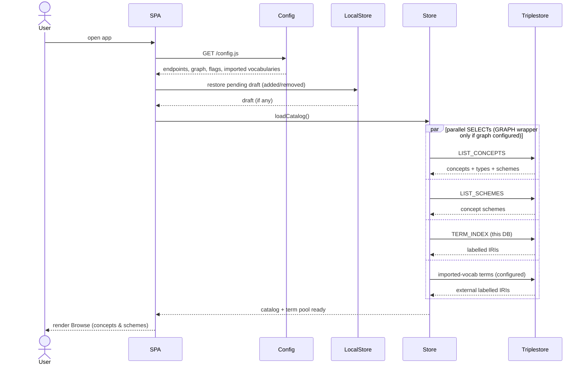
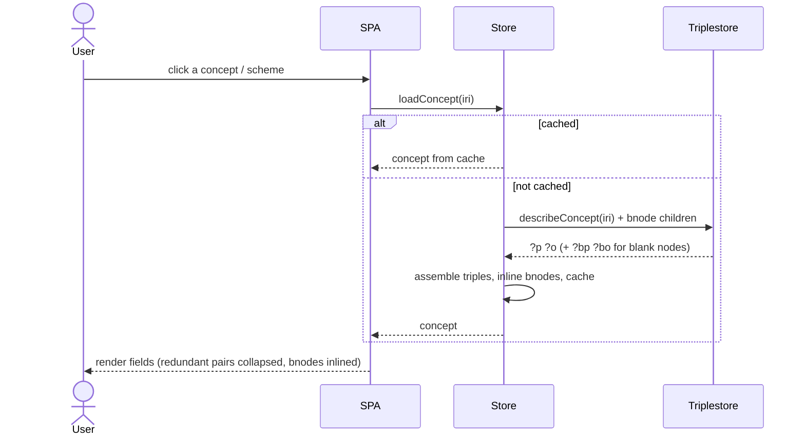
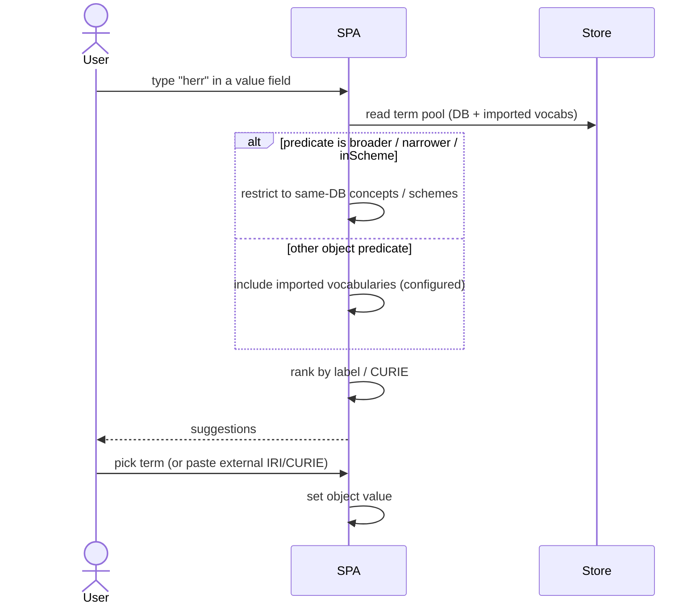
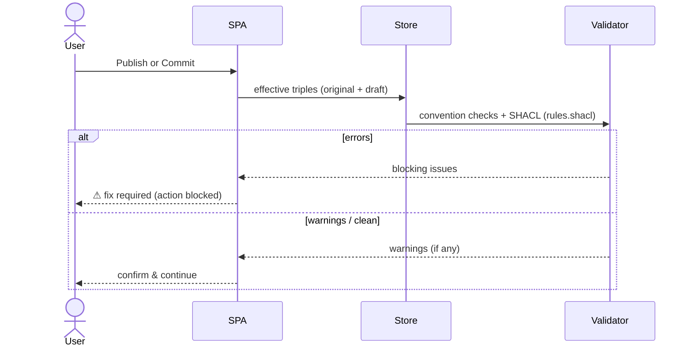
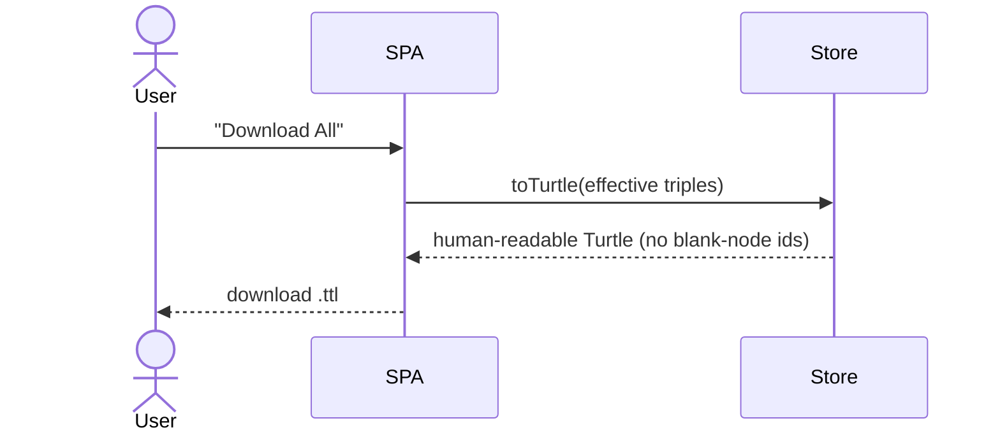
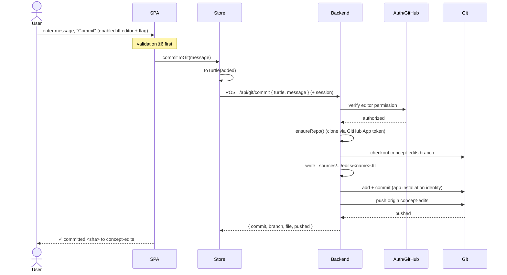
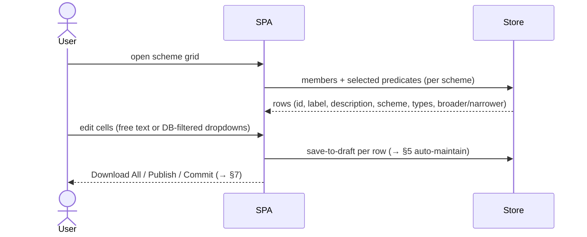
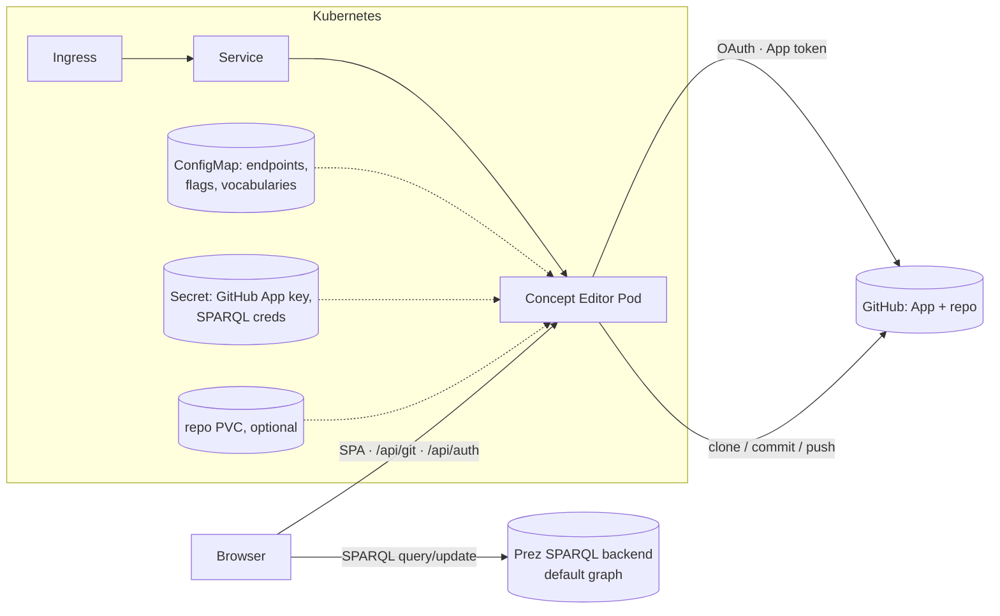

# Data Exchange — Sequence Diagrams

How the SeaDOTs Concept Editor exchanges data with the **triplestore** (the Prez
SPARQL backend), with **git**, and with **GitHub authentication**.

> **Scope:** these diagrams describe the **target architecture per the
> [roadmap](roadmap.md)** — not every step is implemented yet. Each section is
> tagged ✅ implemented · ◑ partial · ☐ planned. See the roadmap's traceability
> matrix for phase mapping. Diagrams use [Mermaid](https://mermaid.js.org/).

## Participants

| Actor | Role |
|-------|------|
| **User** | Editor (non-RDF expert) using the browser UI; may be anonymous |
| **SPA** | React single-page app (`src/`) in the browser |
| **Store** | In-browser Zustand store: catalog cache + pending-edit diff (`src/store/useStore.ts`) |
| **LocalStore** | Browser `localStorage` — persists the pending draft across reloads ☐ |
| **Config** | Runtime config served by the backend at `/config.js` (endpoints, graph, feature flags, imported vocabularies, auth) |
| **Validator** | Convention + SHACL checks (configurable RDF validators) ☐ |
| **Triplestore** | Prez SPARQL backend — Query (`/prez-b/sparql`) + Update; **default graph** |
| **Backend** | Node server (`server/`): serves the SPA, the git API, and the auth/session API |
| **Auth/GitHub** | GitHub App + OAuth — login and repo-privilege (RBAC) resolution ☐ |
| **Git** | The `bblocks-seadots` repository |

**Trust boundaries.** RDF reads/writes go **browser → triplestore directly**
(CORS-open). Git and authentication cannot run in a browser, so they go
**browser → backend → GitHub/git**. All endpoints, flags and vocabularies are
**injected via `/config.js`** — nothing is hardcoded.

---

## 1. Authentication & session (GitHub App + RBAC) ☐ planned

Anonymous users can edit and export. Login resolves the user's GitHub privileges
on the configured repo; **editor (push) access** unlocks Publish and Commit.

```mermaid
sequenceDiagram
    actor User
    participant SPA
    participant Backend
    participant Auth/GitHub

    User->>SPA: open app (anonymous)
    SPA->>Backend: GET /api/session
    Backend-->>SPA: { role: "anonymous" }
    SPA-->>User: edit + Download enabled; Publish/Commit hidden

    User->>SPA: click "Login with GitHub"
    SPA->>Backend: GET /api/auth/login
    Backend->>Auth/GitHub: OAuth authorize (GitHub App)
    Auth/GitHub-->>User: consent screen
    User->>Auth/GitHub: approve
    Auth/GitHub->>Backend: callback (code)
    Backend->>Auth/GitHub: exchange code; get user + repo permission
    Auth/GitHub-->>Backend: identity + push/editor permission
    Backend-->>SPA: session cookie { role: "editor" | "reader" }
    SPA-->>User: Publish/Commit enabled iff role = editor
```

---

## 2. App load — inject config, restore draft, build catalog ◑ partial

On startup the SPA loads runtime config, restores any saved draft, resolves the
session, then issues parallel `SELECT`s — including **configurable imported
vocabularies** folded into the autocomplete term index.



---

## 3. Open a concept for editing ✅ implemented

Fetches every triple about the subject **plus one level of blank-node children**,
so anonymous nodes (e.g. `hasWeight [ qudt:numericValue 0.5 ]`) are inlined and
never shown as bnode ids.



---

## 4. Autocomplete — DB terms + imported vocabularies, same-DB constraints ◑ partial

Suggestions are filtered **client-side** from the loaded pool. Object pickers for
`broader`/`narrower` and `inScheme` are **restricted to same-DB** terms; other
object pickers also offer **configured imported vocabularies**.



---

## 5. Edit locally — auto-maintain conventions, persist draft ◑ partial

"Save to draft" never touches the server. It diffs edited rows against the
original triples, **auto-maintains VocPrez conventions** (inverse/bidirectional
triples, `prefLabel`⇄`rdfs:label` mirroring, top-concept & Dataset membership),
and persists the draft to `localStorage`.

```mermaid
sequenceDiagram
    actor User
    participant SPA
    participant Store
    participant LocalStore

    User->>SPA: edit values / add predicate / add field
    User->>SPA: "Save to draft"
    SPA->>Store: diff rows vs original (add/remove triples)
    Store->>Store: auto-maintain conventions
    note right of Store: mirror prefLabel⇄rdfs:label;<br/>add inverse isPartOf/hasPart,<br/>hasTopConcept/inScheme;<br/>derive top-concept; Dataset link
    Store->>Store: reconcile diff (cancel opposing edits)
    Store->>LocalStore: persist { added, removed }
    Store-->>SPA: pending diff updated
    SPA-->>User: Pending changes badge (n)
```

---

## 6. Validate before persisting ☐ planned

Both write paths (Publish, Commit) run the **configurable validators** first;
warnings are shown and blocking errors stop the action.



---

## 7. Persist — Download All / Publish / Commit

Three actions on every edit page. **Download All** is available to anyone;
**Publish** and **Commit** are **disabled by default** and gated by **feature
flags + RBAC** (editor role from §1).

### 7a. Download All ✅ (rename pending)



### 7b. Publish — SPARQL UPDATE ◑ (RBAC/flags planned)

```mermaid
sequenceDiagram
    actor User
    participant SPA
    participant Store
    participant Triplestore

    User->>SPA: "Publish" (enabled iff editor + flag)
    note over SPA: validation §6 first
    SPA->>Store: pushToSparql()
    Store->>Store: toSparqlUpdate(added, removed)
    note right of Store: default graph ⇒ no GRAPH wrapper;<br/>bnode removals via DELETE WHERE
    Store->>Triplestore: POST update (DELETE DATA; INSERT DATA)
    alt accepted
        Triplestore-->>Store: 200 OK
        Store->>Store: clear draft + invalidate cache
        Store->>Triplestore: reload catalog
        Store-->>SPA: success
        SPA-->>User: ✓ published
    else rejected (auth / read-only / validation)
        Triplestore-->>Store: 4xx/5xx
        SPA-->>User: ⚠ message
    end
```

### 7c. Commit to Git ◑ (RBAC/GitHub App planned)



---

## 8. Concept Scheme — tabular bulk edit ☐ planned

The Concept Scheme editor (`/conceptScheme/:iri`) edits many concepts in a grid;
each cell edit flows into the **same draft/auto-maintain/persist pipeline**
(§5–§7) — no separate data path.



---

## Deployment view

The SPA, git API and auth/session API are served by the **same** Node container;
SPARQL traffic goes browser → Prez. GitHub App credentials, endpoints, flags and
vocabularies are injected (never baked into the image).



See [`roadmap.md`](roadmap.md) for phase status,
[`../helm/seadots-concept-editor`](../helm/seadots-concept-editor) for the chart,
and [`../DEPLOY.md`](../DEPLOY.md) for build/deploy commands.
