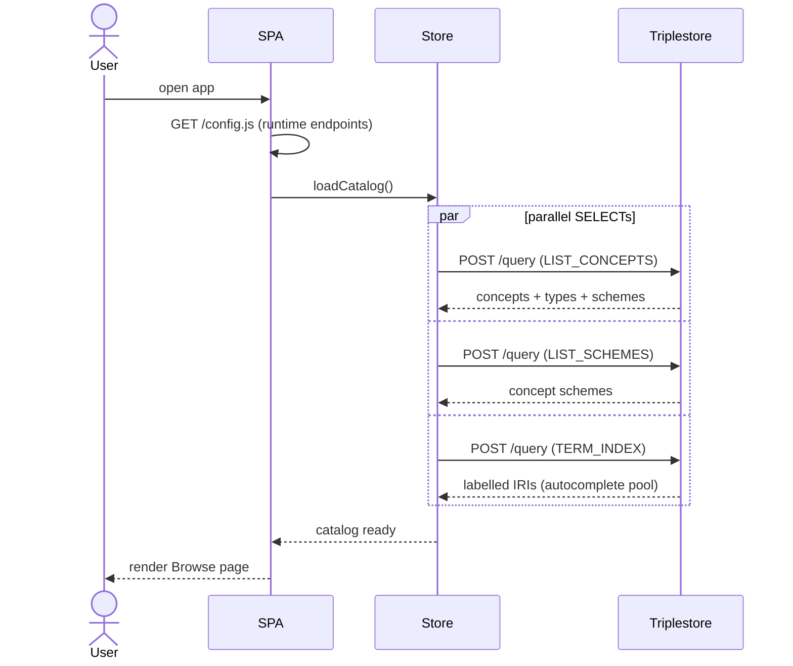
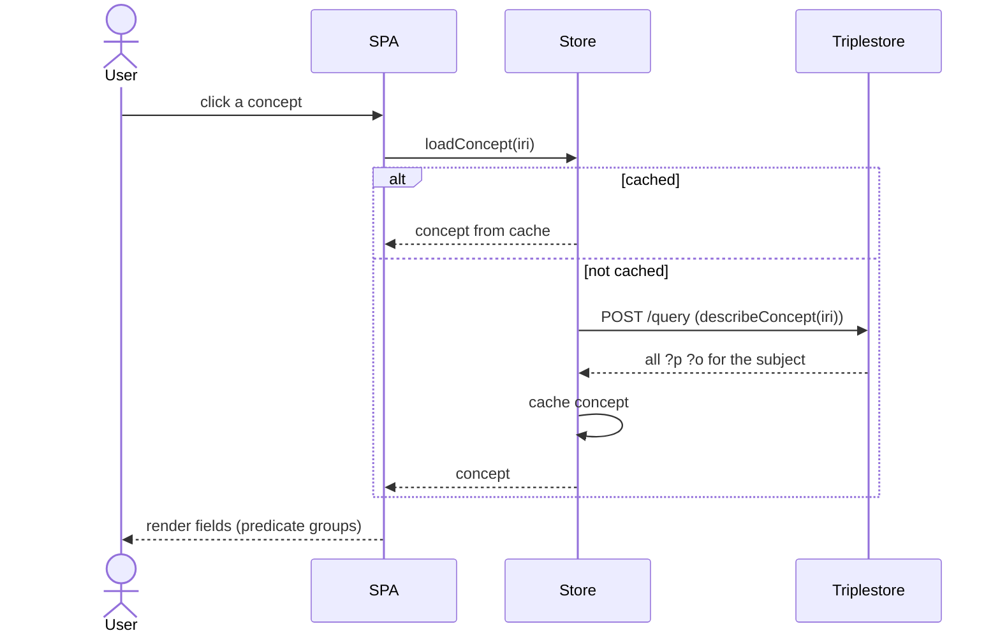
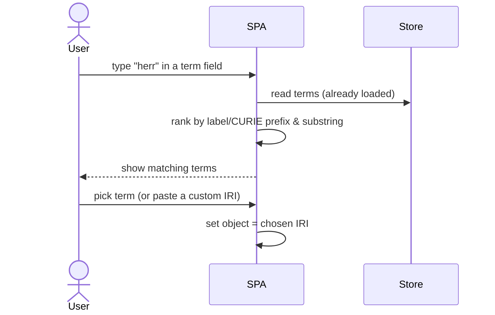
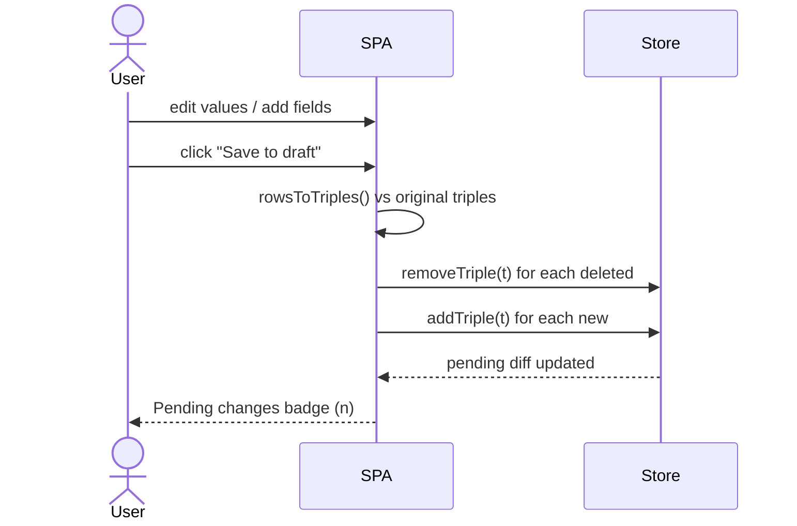
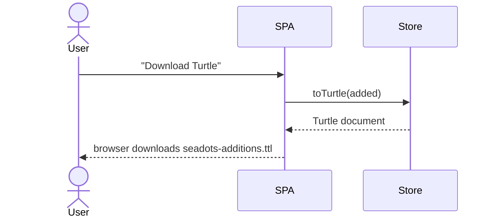
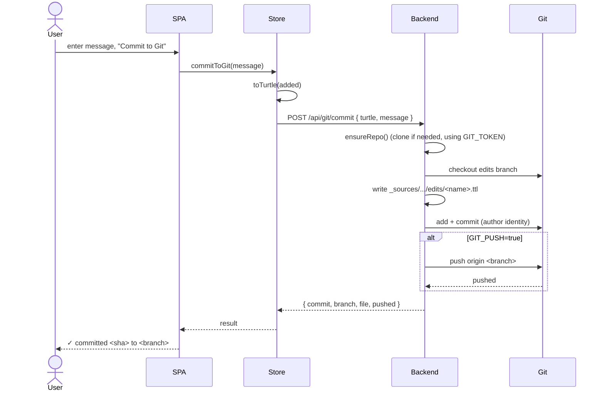
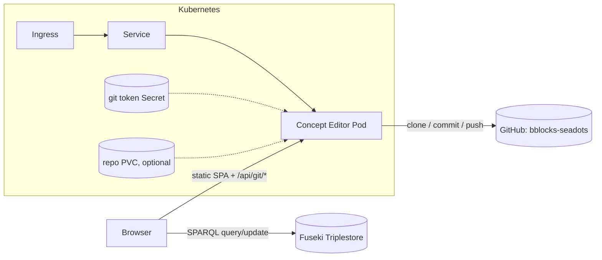

# Data Exchange — Sequence Diagrams

How the SeaDOTs Concept Editor exchanges data with the **triplestore** (Fuseki
SPARQL endpoint) and with **git**. Diagrams use [Mermaid](https://mermaid.js.org/);
GitHub renders them inline.

## Participants

| Actor | Role |
|-------|------|
| **User** | Non-RDF expert using the browser UI |
| **SPA** | React single-page app (`src/`) running in the browser |
| **Store** | In-browser Zustand store holding the catalog cache + pending-edit diff (`src/store/useStore.ts`) |
| **Triplestore** | Fuseki SPARQL Query + Update endpoints (`/query`, `/update`) |
| **Backend** | Node/Express server (`server/`) serving the SPA and the git API |
| **Git** | The `bblocks-seadots` repository |

Reads/writes of RDF go **browser → triplestore directly** (the endpoint returns
permissive CORS headers). Git operations cannot run in a browser, so they go
**browser → backend → git**.

---

## 1. App load — fetch catalog and term index

On startup the app issues three SPARQL `SELECT` queries in parallel to populate
the browse list, the scheme filter, and the autocomplete term index.



---

## 2. Open a concept for editing

Selecting a concept fetches every triple about it (a `SELECT` acting as a
`DESCRIBE`), which is cached and expanded into editable field rows.



---

## 3. Autocomplete — filter vocabulary terms while typing

When assigning an object value, suggestions are filtered **client-side** from
the already-loaded term index — no round-trip per keystroke.



---

## 4. Edit locally — build a pending-change diff

"Save to draft" does **not** touch the server. It diffs the edited rows against
the concept's original triples and records the delta as `added` / `removed`
triple sets in the store.



The store reconciles opposing edits (re-adding a removed triple cancels the
removal, and vice-versa) so the diff stays minimal.

---

## 5a. Persist — push to the triplestore (SPARQL UPDATE)

Applies the diff directly to the named graph as one `DELETE DATA` + `INSERT DATA`
update. May require credentials on the update endpoint.

```mermaid
sequenceDiagram
    actor User
    participant SPA
    participant Store
    participant Triplestore

    User->>SPA: "Push to triplestore"
    SPA->>Store: pushToSparql()
    Store->>Store: toSparqlUpdate(added, removed)
    Store->>Triplestore: POST /update (DELETE DATA; INSERT DATA)
    alt accepted
        Triplestore-->>Store: 200 OK
        Store->>Store: clear diff + invalidate cache
        Store->>Triplestore: reload catalog
        Store-->>SPA: success
        SPA-->>User: ✓ pushed
    else rejected (auth/validation)
        Triplestore-->>Store: 4xx/5xx
        Store-->>SPA: error
        SPA-->>User: ⚠ message
    end
```

## 5b. Persist — download Turtle

A purely client-side export of the additions for review/commit through the
normal bblocks repo workflow.



---

## 6. Persist — commit & push to git (via backend)

The governed path: the SPA serialises additions to Turtle and POSTs them to the
backend, which writes a file, commits on the edits branch, and pushes upstream.



> The backend reads its git settings (remote URL, branch, token, author, edits
> path) from environment variables — see [`server/git.mjs`](../server/git.mjs)
> and the Helm `git.*` values.

---

## Deployment view

In production both the SPA and the git API are served by the **same** Node
process (the container), while SPARQL traffic still goes browser→triplestore.



See [`../helm/seadots-concept-editor`](../helm/seadots-concept-editor) for the
chart and [`../DEPLOY.md`](../DEPLOY.md) for build/deploy commands.
