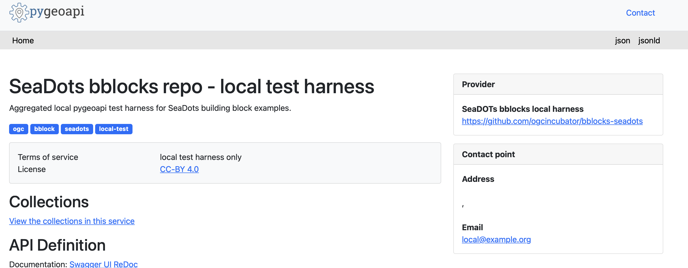
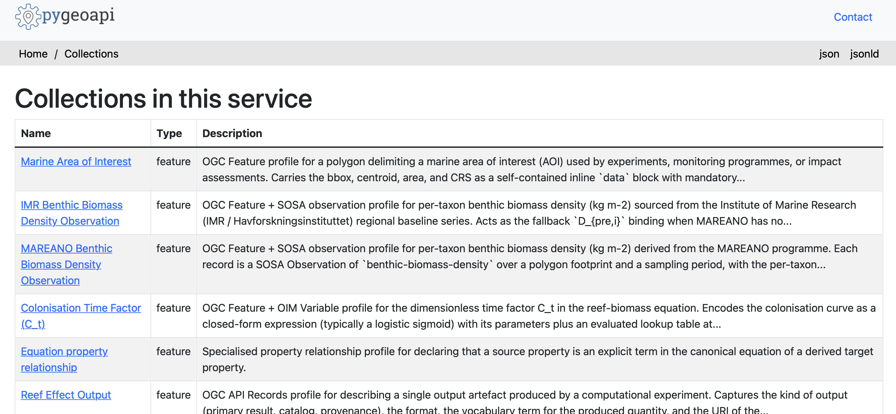
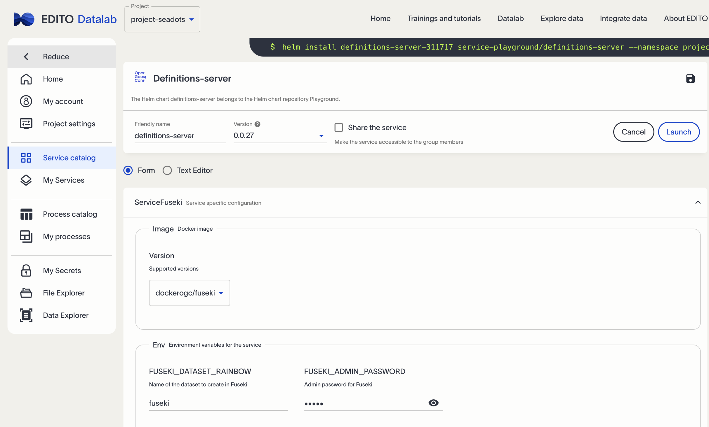
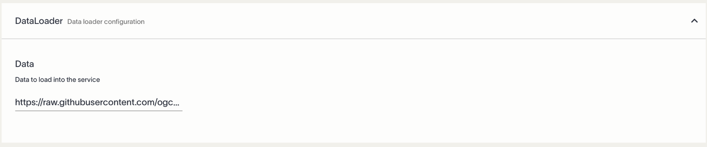
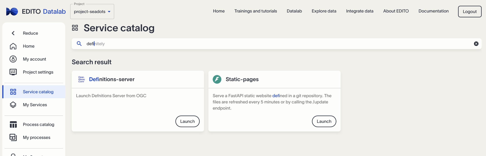

# Case definition

This document is a presentation script and worked example for a reusable digital
twin impact-assessment workflow. The concrete example is the reef-effect
calculation for a planned offshore wind farm near Utsira Island, Norway. The
same pattern can later be reused for other demonstrators, including fisheries
impact scenarios north of Gotland, Sweden. [for review]

The offshore-wind setup can vary by number of turbines, turbine size, cable
routing, anchoring design and floating-platform configuration. The purpose of
this script is not to solve the whole impact model in one step, but to document
how one impact component can be described, wired to data, executed and published
as reusable digital-twin infrastructure. [for review]

## Presentation storyline

This script follows the presentation sequence starting from the SEATwins part of
the deck. The narrative is not only "calculate reef effect"; it is "show how a
digital-twin impact calculation becomes reusable, inspectable and testable when
the model, inputs, outputs and execution records are expressed as building
blocks".

### SEATwins context

The SEATwins discussion connects EcoTwin, SURIMI, SeaDOTs, ILIAD, EDITO and VLIZ
around a shared problem: marine digital twins should not remain isolated data
silos. The aim is to move toward a more cohesive marine infrastructure where
data, model interfaces, quality information and execution outputs can be reused
across projects and platforms.

Key interoperability points from the deck:

- **Vector-raster challenge**: cloud-friendly storage is not enough; agreed
  schemas are needed so raster, vector and tabular assets can be discovered and
  wired into applications.
- **Semantic harmony**: models should "talk" to each other through controlled
  vocabularies such as FAO, ICES, Darwin Core, OGC/ISO and project-specific
  indicator vocabularies.
- **Model trust**: validation protocols are needed from individual model inputs
  through to complex ensembles, because stakeholders need to understand why a
  result is believable.
- **EDITO ecosystem**: the target environment influences how applications,
  assets, catalog records and validation outputs should be packaged.

### Use case: impact assessment of an offshore wind farm

The deck uses the Utsira offshore-wind reef-effect calculation as the running
example. The intentionally provocative prompt is:

> Dear AI, calculate the reef effect of the WindFarm planned next to Utsira island.

A pure "ask AI for the answer" workflow is not trusted. The deck notes the risk
of confident but unsupported output ("It is Five!") and points to the need for
auditable calculation structure rather than ungrounded answer generation.

The deterministic approach is organised as:

1. **Model definition**: define what is being calculated and which model or
   equation is being used.
2. **Data availability**: determine whether variables can be populated and what
   quality requirements apply.
3. **Model binding**: bind source data and configuration values to the model
   inputs.
4. **Test execution and outputs capture**: run the model, capture outputs,
   provenance and catalog records.
5. **Scaling**: make the workflow reusable for more scenarios, data sources and
   execution environments.

### Agentic coding frame

The presentation treats agents and skills as useful scaffolding, not as a
replacement for review. The goal is to use agentic coding to generate repeatable
interfaces, tests and catalog metadata while keeping humans in the loop for
model boundaries, data suitability and trust decisions.

Operational concerns named in the deck:

- production readiness
- CI/CD/CT and continuous evaluation
- observability and operations
- change management and maintenance
- safety and review boundaries

Related references from the deck:

- Code as Harness: https://arxiv.org/abs/2605.18747
- Agentic coding source material: https://arxiv.org/html/2505.19443v1

### Presentation checkpoints

The deck steps through the following checkpoints, which are expanded in the
sections below:

1. Define the deterministic reef-effect model.
2. Define variables and indicators.
3. Publish or check vocabulary terms in the EDITO vocabulary service.
4. Wrap simulation/application metadata using APKG and OGC/Open Science
   patterns.
5. Define input and output profiles.
6. Check real source data using the data usability check-in pattern.
7. Run a local sandbox test with generated pygeoapi configuration.
8. Capture persistent blocks so the calculation can be reused, inspected and
   scaled.

## Related policies

The table below is used to motivate why biomass and biodiversity indicators are
relevant to offshore-wind impact assessment. [TODO: verify each policy URL and
replace placeholder/source-domain links with authoritative Norwegian/EU legal or
policy references.]

| Regulation | Biomass / Biodiversity Indicator Covered |
| :--- | :--- |
| **[Offshore Energy Act](https://regjeringen.no)** | * **Species Richness & Abundance**: Counts of sessile benthic species and artificial reef colonization rates<br>* **Avian Collision Rates**: Annual migratory bird and seabird mortality counts<br>* **Fish Stock Biomass**: Population density and localized biomass metrics of commercial target fish |
| **[Nature Diversity Act](https://wiley.com)** | * **Ecological Status Index**: Aggregate score of target ecosystem vitality compared to baseline references<br>* **Threatened Species Population**: Population health/viability metrics for red-listed marine mammals, fish, and birds<br>* **Benthic Habitat Footprint**: Acreage/percentage of loss or degradation to selected and prioritized subsea habitat types |
| **[Marine Resources Act](https://pnnl.gov)** | * **Marine Trophic Index**: Metric tracking shifts in the average trophic levels of caught and observed seafood species<br>* **Spawning Stock Biomass (SSB)**: Measurement of the total weight of sexually mature fish within the farm footprint<br>* **Aquaculture Kelp/Algae Biomass**: Total organic matter yields and structural changes in neighboring marine farming zones |
| **[Planning and Building Act](https://wiley.com)** | * **Direct Habitat Loss (Acreage)**: Spatial calculation of physical seabed occupation by turbine foundations and cables<br>* **Potentially Disappeared Fraction (PDF)**: Modeling of species lost per gigawatt-hour (GWh) due to physical disturbance and barrier effects |
| **[Pollution Control Act](https://wiley.com)** | * **Acoustic Disturbance Thresholds**: Underwater noise levels (in decibels) affecting marine mammal communication and migration paths<br>* **Turbidity & Sedimentation Load**: Concentration of suspended particulate matter affecting filter-feeding benthic biomass during cabling |


The whole impact model is a complex one: it tries to estimate interactions
between environmental, social and economic variables.


For the presentation, one component of this wider model is isolated:

- The reef effect is calculated for potential farm setups. It is not the most
  complex equation, but it can later be wired into the wider impact model.
- The calculation may be exposed as an application others can use. An AI
  "crystal ball" could provide an answer, but the workflow needs to show where
  the answer came from and how it can be checked.
- For simulation-based uses of the application, outputs should be collected so
  future machine-learning or model-comparison workflows can learn from the
  relationships between variables. [for review]
- Since there are many potential inputs, the model should be wireable to
  existing data sources.
- In effect, this creates a trustworthy register of simulation outputs, their
  sources and control parameters, which others can use directly or tune
  according to their needs and data availability.

OGC building blocks define the interface to the application:

- what the model is about
- what parameters it takes
- which parameters are fixed
- which parameters are flexibility points
- how inputs, outputs, provenance and execution records are exposed [for review]

## Good practice of ODD protocol

The ODD protocol is a document-based framework for describing agent-based model
implementations. It includes forcing variables, control variables, assumptions,
equations and model entities or agents.

Example of the protocol compliant with OGC Records can be expressed in similar way: https://ogcincubator.github.io/bblocks-seadots/bblock/ogc.hosted.seadots.odd-protocol/data-structure 

This building block was co-created with AI assistance and the
`/iliad-apis-features/.agents/.building-block-generator.md` workflow.

## AI assisted development assumptions

AI tools, agents and MCP-style integrations can wire the model to data, but the
ETL process, platform boundaries and application boundaries must remain
reviewable.

AI assistance is useful for scaffolding building blocks, context mappings,
transforms, pygeoapi harnesses and validation reports. It is not sufficient for:

- deciding whether the model boundary is scientifically appropriate
- deciding whether a data source is representative enough for the area of
  interest
- accepting quality assumptions without evidence
- publishing a model output without traceable inputs, configuration and
  provenance

The human-in-the-loop review points in this example are:

- area of interest
- taxa/species of interest
- recency of observations
- trustworthiness of source systems
- whether expected natural fluctuations are acceptable for the intended
  decision


## Tutorial scope

This exercise focuses on resolving one of the elements which is 'Reef effect'.
Studies show, that solid elements of the windparks and O&G platforms create environment simlar to natural conservation. Truely protected by law and operations area free from fishing trawling, together with solid elements of the setup effect in the biomass growth.

The target calculation estimates reef effect for the Utsira island wind-farm
setup using an equation known from research or policy.

This exercise focuses on one element: the **reef effect**. Studies show that
solid elements of offshore wind farms and oil-and-gas platforms can create
habitats similar to artificial reefs. Areas protected from trawling, together
with hard substrate introduced by the infrastructure, can affect benthic biomass
growth and species aggregation. [for review]

The reef effect for the Utsira wind-farm setup should be estimated using an
equation known from research or policy. [TODO: cite the exact equation source or
policy source used for the final presentation.]

## Model type and boudaries

For the reef effect, there is a known equation that can be used to calculate the
effect. It can be used as a one-shot calculation, but it is often recalculated in
turns as the model state or input data is updated. [for review]

The deck frames this as **model based calculation**: after reviewing model
descriptions and research papers, the worked example intentionally simplifies
the calculation to a deterministic equation. The purpose is not to claim that
the whole impact assessment is simple, but to show the reusable interface around
one calculation that can later be wired into the wider digital-twin model.

The equation can be described with a template like this:
https://ogcincubator.github.io/bblocks-seadots/bblock/ogc.hosted.seadots.equation-property-relationship/examples
to capture what it takes:

Key element is here:
```
"wasDerivedFrom": [
      "indo:submerged-infrastructure-area",
      "indo:baseline-benthic-biomass-density",
      "indo:reef-aggregation-index",
      "indo:colonisation-time-factor"
    ],
    ...
    "equation": "B_{reef} = \\sum_i (A_{sub} \\cdot D_{pre,i} \\cdot AF_i \\cdot C_t)",
```
It is not always necessary to define a new equation. In many cases the model is
a black-box or third-party application. What is needed is an explicit description
of the variables it consumes and the outputs it produces. [for review]
 
In this case, the reef-effect calculation is part of a larger model, but already
needs the following variables:

"indo:submerged-infrastructure-area",
      "indo:baseline-benthic-biomass-density",
      "indo:reef-aggregation-index",
      "indo:colonisation-time-factor"

The useful part is that these variables are defined, so the intended model
semantics are explicit.

There are following types:
  - assessment input for given location: *indo:submerged-infrastructure-area*, *indo:baseline-benthic-biomass-density*
  - habitat change factors that are not known a priori but can be estimated from similar cases: *indo:reef-aggregation-index*, *indo:colonisation-time-factor*
  
- *indo:submerged-infrastructure-area* - this should be estimated from the
  wind-farm setup: the area of solid surfaces in the design and in real
  conditions. In this case, if the seabed is muddy, the calculation includes only the farm
  elements that add hard substrate, such as pillars, concrete, anchors and other
  submerged infrastructure. [for review]
- *indo:baseline-benthic-biomass-density* - this should come from observations.
  The relevant observation input must be identified and wired into the model.
- *indo:reef-aggregation-index* - this factor must be anticipated from similar
  experiments or model outputs. Fortunately, it was calculated by another
  project and reference numbers are available.
- *indo:colonisation-time-factor* - this factor is related to the reef
  aggregation index and to the time extent of the simulation. It is also a time
  period that other models can influence or read as the current state. [for
  review]

## Execution frames

In the current conditions it is a
simple equation which can be programmed and bundled, but it still needs explicit wiring for every execution:
* data source provides which variable,
* configuration values are used, and
* output records are produced. [for review]

This is the point where the calculation shifts from "a
formula" to "an application". The application profile must state which input
profiles it accepts, which output profiles it produces, and which of these are
required. This is the part that allows later executions to be compared: every
execution is an instance of the same workflow, but with concrete input records,
time boundaries and output records.


### OGC Building Blocks 

Building blocks approach is based on the assumption that small, composable elements of specifications are useful for interfaces definition as they:
* propagate the same or similar data models - limiting ambiguous data mappings
* formalise elements like schemas, Linked Data context
* can be shared and profiled according to use case needs

In this scenario, following registers will be used:
* https://ogcincubator.github.io/iliad-apis-features/
* https://ogcincubator.github.io/bblocks-seadots/bblock
* https://ogcincubator.github.io/bblocks-openscience/

In addition, following sgents and skills will be used for AI assited work:
* https://github.com/pzaborowski/ogcaibb

While there are some tools for custom LLM foundation model integration, it is efficient to start with general purpose one tuned for coding like Codex, Claude Opus/Sonnet, Qwen-coder.

Templates like https://github.com/opengeospatial/bblocks-template/blob/master/USAGE.md captures usual elements of the logical data representation as:
* schema - like JSON schema
* examples - also used for validation
* semantic layer - e.g. LD context for JSON data
* descritpion of the bundle - free text and structured
* [opt] advanced validation - e.g. Shape
* [opt] transformers


Working in own repo, these guidances need to be imported into the working repo. e.g.

```
clone https://github.com/ogcincubator/bblocks-seadots.git
clone https://github.com/pzaborowski/ogcaibb.git
cd bblocks-seadots
mkdir .claude
ln -s /Users/piotr/repos/seadots/ogcaibb/agents agents
ln -s /Users/piotr/repos/seadots/ogcaibb/commands commands
ln -s /Users/piotr/repos/seadots/ogcaibb/skills skills
```

### Start defining own execution frames

We will use predefined skill that build structure of the Building Block https://github.com/pzaborowski/ogcaibb/blob/main/agents/generators/building-block-generator.md

```
@bblocks-builder : in the odd-protocol example of the building block, there is an equation of reef effect, propose the pipeline of the data execution and using template from https://ogcincubator.github.io/bblocks-openscience/ propose the experiment description linked to input and output that can later be loaded to estimate reef effect for surroundings of the Utsira island
  ```


The result of this step should not be treated as trusted scientific output. The
agent created structured inputs for the execution and wired the execution to the
protocol. It may have generated example values, but those values must remain
clearly marked as examples until they are replaced or verified with real data.
[for review]

An OGC Process can be created from that structure, or extended with additional
parameters. Before that, the necessary data must be checked for availability and
usability.

## Digression: Application package / workflow wrapping

Example of the Application Package representation as OGC Record with semantic mappings is the APKG the INESC presentation. In this
script the same idea is used as a building-block contract:

- the application package is a template and validation tool for scientists to
  wrap executable metadata
- the repetitive metadata/scaffold work can be automated
- the workflow links the model definition, accepted input profiles, produced
  output profiles and execution records

Deck prompt for the simulation-based application:

```
clone https://github.com/ogcincubator/bblocks-seadots.git

/generate-bblock owf-reef-effect model based on the odd-protocol block,
APKG record block, ogc.osc.geodcat-stac-earthcode.workflows create workflow
block for equation from
https://project-seadots-definition-server.lab.dive.edito.eu/prez/catalogs/marine:catalog/collections/marine:indicators-scheme/items/obs:floating-wind-reef-biomass-effect
```

The expected output of this step is not a final model result. It is a reusable
application/workflow profile that can later be instantiated by executions.


# Creating own data input

This section moves from model definition to data availability. The question is
not only "can values be found?", but "can values be found that are relevant,
traceable and reusable through a documented input profile?" [for review]

## Define variables and indicators

Pre-requisite: define the model boundaries. For the reef-effect calculation this
means deciding which parts of the offshore wind farm setup and which ecological
effects are in scope.

Process from the deck:

1. Identify variables.
2. Map them to known vocabularies.
3. Share and agree the terms.
4. Augment the terms and push them to a vocabulary host, or link to existing
   online definitions.

Relevant resources:

- source variable files in this repository and in `bblocks-seadots`
- EDITO vocabulary service:
  https://datalab.dive.edito.eu/launcher/service-playground/definitions-server?name=definitions-server&shared=false&version=0.0.24&autoLaunch=true
- SeaDOTs indicator scheme endpoint used in the deck:
  https://project-seadots-definition-server.lab.dive.edito.eu/prez/catalogs/marine:catalog/collections/marine:indicators-scheme/items/obs:floating-wind-reef-biomass-effect

The goal is that variables in the equation are not private labels. They become
resolvable indicator/property concepts that can be used by model bindings,
building-block contexts and catalog records.

## Colonisation time factor

This is a factor in the equation: it acts as a multiplier and also defines the
time step or maturity period of the reef effect. It should be related to sensible
values for the reef aggregation index and the simulation time boundary. [for
review]

[TODO: define the default colonisation-time function or lookup table used in the
Utsira example.]

## Reef Aggregation Index

For the Reef Aggregation Index, relevant literature needs to be reviewed. Some of the values can be captured here:
https://raw.githubusercontent.com/ogcincubator/iliad-apis-features/refs/heads/master/_sources/oim-variables/examples/indicators.ttl
and loaded to a vocabulary service deployed on EDITO:
https://datalab.dive.edito.eu/launcher/service-playground/definitions-server?name=definitions-server&shared=false&version=0.0.24


```
@building-block-generator add bblock for variable observation based on the best matching /Users/piotr/repos/Iliad/iliad-apis-features and including following data as an example and value mapped to the indo:reef-aggregation-index - [data from AUX1]

```

The expected workflow is:

1. try to match closest existing example
2. produce schema based on the selected block(s)
3. validate is variables are resolvable - they have definitions in known vocabularies

As an effect it created `/Users/piotr/repos/seadots/bblocks-seadots/_sources/oim-variable-observation`.

[screen]

The data could be exposed in the service or replaced by an existing authoritative
source if one already exists. Similarly to the AUX2 example, it could be exposed
in the target deployment.

[TODO: replace `[screen]` with either an image reference or a short description
of what the generated block contains.]

## Submerged infrastructure area

This value is usually estimated from the wind-farm setup. It is not a
sophisticated calculation in this example, but detailed engineering calculations
can become complex. A common practical approach is to use equivalent submerged
area by density, type and size of the wind farm. This example uses a
constant known from the investment documentation. [for review]

[TODO: add the exact investment-documentation source and the submerged-area value
used in the final example.]

## Baseline benthic biomass density

Biomass density, defined in tonnes per square kilometre or compatible mass/area
units, is available from several sources. The source must be selected based on which is most
reliable, recent and accurate for the intended area of interest. [for review]

The AI output proposes:
https://www.hi.no/api/benthic-biomass-baseline

This is acceptable only if it covers the area and key species of interest, and
if it is recent enough for the scenario. The AI-suggested endpoint must be
verified before being used as evidence. [for review]

[TODO: verify whether this endpoint exists and whether it provides suitable
coverage, species and date range for Utsira.]

The deck expands this into a data-availability and governance step. Candidate
sources mentioned for the sandbox are EMODnet, IMR.no and MAREANO/Moreno-related
project data. The task is not only to find a number, but to decide whether the
source is relevant for the Utsira area, recent enough, representative for the
taxa/species of interest, traceable and technically ingestible.

The recommended agentic step is:

```
/data-usability-checkin-agent.md wire imr.no biomass-density data to
benthic-biomass-density-mareano as BB3
```

This should check quality requirements, connect the source, document metadata,
preserve source data and produce/confirm the target standardised data profile.

## Source-data governance: why three blocks for one source

The deck explains the check-in pattern as three governance layers:

| Layer | Responsibility | Depends on |
|---|---|---|
| Source data | Captures the original data and representative examples. | Third-party source system |
| Target data | Captures the model-facing representation wired to the reef-effect model. | Model developer and target interface |
| Record / catalog metadata | Links source, target, transformations, workflows and execution environment. | Target execution and catalog environment |

This separation is useful because a single source can be reused in multiple
models, and one model-facing target profile may be populated from multiple
sources. The record/catalog block is the glue that makes the source-target
relationship discoverable and reusable.

## Real data sandbox

The deck highlights a "real data sandbox" stage. This is where the human checks:

- area of interest
- taxa/species of interest
- whether the data is recent enough
- whether the source is trustworthy
- whether expected fluctuations are acceptable
- whether asking AI to fill gaps would create unacceptable trust risk

At this stage the variables may be defined in the vocabulary, while sandbox
values are carried in building-block examples or configuration records. Missing
configuration should be explicit rather than hidden in code.

# Fully autonomous calculations

Alternatively, an agent can be asked to propose the whole pipeline. The prompt
below is rephrased from the original transcript but keeps the same intent. 

```
based on the reef effect defined in the odd-protocol example of the building block, propose the pipeline of the data execution and using template from -
  https://ogcincubator.github.io/bblocks-openscience/ outline the experiment description linked to input and output that can later be loaded to estimate reef effect for surroundings of the Utsira island
```

The agent can produce an apparently complete answer, but trust remains close to
zero unless the result is reviewed, linked to real sources and validated.

After adding:

```
... Capture the experiment example, input and outputs as the separate examples and wrap them in the building blocks
```

It will generate the boundaries of the calculation in the following form. The
block below is kept as a raw transcript of the generated output, including its
typos and broken formatting, because it records what the autonomous process
returned. [for review]

[TODO: replace this raw transcript with the current `catalog-application`,
`catalog-workflow`, `catalog-execution` and `catalog-data`
building-block pattern once the presentation and repo converge.]

Three new bblocks added to _sources/
```
  _sources/
  ├── experiment/                              ← experiment record (1 example)
  │   ├── bblock.json                          → ogc.hosted.seadots.experiment
  │   ├── description.md
  │   ├── schema.yaml                          extends geodcat-records, adds `experiment` object
  │   ├── context.jsonld
  │   ├── examples.yaml
  │   └── examples/utsira_surroundings_experiment.json
  
  _sources/iment-input/                        ← one record per input (6 examples)
  │   ├── bblock/                              → expehiment.record (1xexample)
  │   ├── description.md
  │   ├── schema.yaml                          extends geodcat-records, adds `experimentInput` object
  │   ├── context.jsonld                                                                ` object
  │   ├── examples.yaml
  │   └── examples/
  │       ├── aoi_uutsira_surroundings_experiment.json  role=AOI                         (no eq. symbol)
  │       
  ├── experiment-input/                        ← one record per input (6 examples)       
  │   ├── bblock.json                      .jso→ ogc.hosted.seadots.experiment-input     
  │   ├── description.md
  │   ├── schema.yaml                          extends geodcat-records, adds `experimentInput` object
  │   ├── context.jsonld
  └── ├──eexamples.yaml/                       ← one record per output (3 examples)
  │   └── examples/
  │       ├── aoi_utsira_surroundings.json              role=AOI                         (no eq. symbol)
  │       ├── infrastructure_layout_60x15mw.jsonxtends grole=feature-of-interestperimentOeq.ubindingcA_{sub}
  │       ├── exrejno_baseline_density.json             r le=primary baseline            eq. binding D_{pre,i}
  │       ├── imr_baseline_density_fallback.json        role=fallback baseline           eq. binding D_{pre,i}
  │       ├── reef_aggregation_index_bindings.json      role=coefficient (per taxon)     eq. binding AF_i
  │       └── colonisation_time_factor.json    role=primrole=coefficientr(scalar)sum-overeq. binding C_t
  │       
  └── experimenr-output/                       ← one recordnper outputo(3oexamples)Prov 0.6
      ├── bblock.json                          → ogc.h sted.s adots.experiment-output
  Comp├──tdescription.md
      ├── schema.yaml                          extends geodcat-records, adds `experimentOutput` object
  The ├──econtext.jsonldcarries no input/output payload — it references each as a Link:
      ├── examples.yaml
  expe└──eexamples/[] → URIs of experiment-input records
          ├── reef_biomass_ge parqupt.json     rol =pcimary result   aggregation=sum-over-i
          ├── sdac_catalog.jDon m              role=catalog
          └── prov_record.json            r   rrole=provenance URI   conformsTo CWLProv 0.6
```

  Composition pattern:
  * Each experiment-input carries its own equationBinding and parameterBinding.cwlInput, so a consumer can resolve any one input independently and know both which equation symbol it parameterises and which
  * The experiment record         no input/output payload — it references each as a Link:
  experiment.inputs[] → URIs of experiment-input records
  experiment.outputs[] → URIs of experiment-output records
  experiment.modelledBye→sODDddemonstratoroURIodd-protocol/examples/utsira_reef_biomass_experiment.json and its entry in odd-protocol/examples.yaml (replaced with a comment pointing at the three new
  exporim)nt.evidenceEquation → equation-property-relationship URI
  experiment.applicationPackagec→lCWLafiles(stillaineodd-protocol/examples/)) stays where it is and is referenced from the new experiment record via a relative service link.

  * Each experiment-input carries its own equationBinding and parameterBinding.cwlInput, so a consumer can resolve any one input independently and know both which equation symbol it parameterises and which
  CWL port it feeds.
  Run validate-bblock over the three new blocks via the symlinked validation agent to confirm the postprocessor accepts them.
  Side cleanup
✻ Cogitated for 6m 30s
  - Removed the now-superseded bundled record odd-protocol/examples/utsira_reef_biomass_experiment.json and its entry in odd-protocol/examples.yaml (replaced with a comment pointing at the three new
※ bblocks).al: publish a reef-effect computational experiment for Utsira surroundings as SeaDOTs bblocks. The bundled experiment is split into three new blocks (experiment, experiment-input,
  - The CWL pipeline (odd-protocol/examples/utsira_reef_biomass_pipeline.cwl) stays where it is and is referenced from the new experiment record via a relative service link.


## Testing and scaling

Once all the interfaces are initially defined, they shall be tested:
 * for compliance with target platform tools to make sure it has not drifted 
 * for completeness according to the taken rule - in this case Building Blocks constraints

 For the second, one can run local ./build script or use 
ogcaibb/agents/validators/validation-agent.md Agent

For the first, it will depend on the target deployment. Here we use *pygeoapi*, reference OGC APIs implementation.

ogcaibb/agents/validators/pygeoapi-test-harness.md Agent should be able to prepare configurations for this application.

# AUX Test model run

The deck uses the pygeoapi harness as the "test model run" checkpoint. The
harness is not a deployment target; it is a local sandbox to prove that the
building blocks can be served and validated as OGC API resources.

Deck command:

```
/pygeoapi-test-harness.md bblocks-seadots
```

What the harness does:

- for each selected block in the repository, generate a pygeoapi test
  configuration
- create file-provider configuration from examples
- create rendering templates for JSON-LD and record views
- run a local pygeoapi container
- test that responses match the examples and schemas

What the harness does not do:

- deploy any real environment beyond the local sandbox
- wire to live data providers
- replace production API configuration
- make claims about source-data quality beyond the examples being served


## AUX2 - Building Block to service setup

A building block is an interface contract. It does not expose live data by
itself, apart from examples. Transformations are references or reusable scripts;
they still need an execution environment.

There are many ways and software stacks that could expose such services. This
example shows a validation step that, as a side effect, creates a tailored
renderer for Records in pygeoapi. Render templates are supported by pygeoapi, and
the agent generates the necessary configuration. [for review]

This step uses `iliad-apis-features/.claude/agents/validators/pygeoapi-test-harness.md`.

```
pygeoapi-test-harness.md based on the [path to]/iliad-apis-features/_sources/apkg-record, create the setup for pygeoapi and test it works
```

It will:

- read the schema, context file and examples inside the building blocks
- create a renderer template that exposes the building-block-defined variable
  mappings
- run the service in a Docker-based sandbox
- validate that rendered output matches the schema
 

With a little luck, the service will also be available by default under
http://localhost:5000


 
It is a clean configuration, so it contains no other resources.



 
Record description is taken from the building-block definition.


 

Number of entries matches examples - they are treated as the validation data.


 

The item renders similarly to the INESC setup: without their pygeoapi flavour,
but with data that remains consistent one-to-one. [for review]

 

The JSON-LD representation contains the vocabularies used for the properties.

 


# Persistent blocks: why useful

The deck closes the worked example by explaining why the building blocks are
worth keeping even when the calculation is small.

Persistent reusable artefacts:

- the equation is referenced in the workflow
- the workflow/model has an explicit interface definition
- source-data acquisition and transforms to model interfaces are reusable
- variables are captured, vocabulary-aligned and annotated
- execution outputs can be collected for future model comparison, training or
  scenario analysis

This is useful when the calculation must be
* transparent,
* repeatable,
* integrated
with other models or exposed through a catalog.

It is less useful when the model
is:
* obvious,
* can be done on paper,
* does not need reproducibility, or
* is
already governed by another complete integration framework.

# Reusability

Once blocks are defined for one model, thay can be reused by the next ones.
AI is quite efficient in generating by example and mixing heuristic and deterministic processes as defined in agents skills.

For example switching to the other data source for biomass density would need adding one more source data with transformer to the application input

# Complete setup

Next maturity step as a balance between skills/agents
and code. Some actions should become reliable code, while agents remain useful
for discovery, scaffolding and review support.

Open setup questions:

- **Discoverability of blocks**: agents need a cheap way to find the right
  building block instead of reading full repositories every time.
- **Resource indexes / embeddings**: reading files is expensive, and reading
  external repositories is more expensive; a compact index of "what this block
  is for" helps.
- **Context matching**: descriptions should be condensed enough that the right
  block can be selected by purpose, schema and vocabulary coverage.
- **Model tuning**: repeated executions and captured outputs can support model
  comparison, calibration or learning.
- **Shared feedback loop**: human review and run results should improve the
  agent/task memory and the building-block catalog over time.

Conceptual setup

```
AI Client
  -> Agentic framework
  -> Hosted model
  -> Tasks and feedback memory
  -> Requests / feedback loop streams
```

# Additional Info

The auxiliary sections keep source material that supports the walkthrough but is
not part of the main narrative. [for review]

## AUX1 data

Reef Aggregation Index estimated values:
```
@prefix rdf:   <http://w3.org> .
@prefix rdfs:  <http://w3.org> .
@prefix xsd:   <http://w3.org> .
@prefix sosa:  <http://w3.org> .
@prefix geo:   <http://opengis.net> .
@prefix dct:   <http://purl.org> .
@prefix ex:    <http://example.org> .

### --- Core SOSA Property Definitions ---
ex:reefAggregationIndex a sosa:ObservableProperty ;
    rdfs:label "Per-taxon Reef Aggregation Index" ;
    rdfs:comment "The ratio of local organism density near artificial infrastructure to background control density." .

### --- Features of Interest with Corrected GeoSPARQL Footprints ---

# 1. Moray Firth, Scotland (Beatrice & Moray East Wind Farms)
ex:MorayFirth_Jacket_Zone a sosa:FeatureOfInterest , geo:Feature ;
    rdfs:label "Moray Firth Demersal Zone (Beatrice & Moray East Offshore Wind Farms)" ;
    rdfs:comment "Water depth between 35 and 60 meters with complex jacket turbine foundations." ;
    geo:hasGeometry ex:MorayFirth_Geometry .

ex:MorayFirth_Geometry a geo:Geometry ;
    rdfs:label "Moray Firth Wind Farms Footprint Polygon" ;
    geo:asWKT "POLYGON((-3.15 58.15, -2.85 58.15, -2.85 57.95, -3.15 57.95, -3.15 58.15))"^^geo:wktLiteral .


# 2. Block Island Wind Farm, Rhode Island, USA
ex:BlockIsland_Jacket_Zone a sosa:FeatureOfInterest , geo:Feature ;
    rdfs:label "Rhode Island Block Island Wind Farm Zone" ;
    rdfs:comment "A five-turbine, 30-MW jacket-style array located roughly 6 km off the coast of Rhode Island." ;
    geo:hasGeometry ex:BlockIsland_Geometry .

ex:BlockIsland_Geometry a geo:Geometry ;
    rdfs:label "Block Island Wind Farm Bounding Box" ;
    geo:asWKT "POLYGON((-71.55 41.13, -71.51 41.13, -71.51 41.11, -71.55 41.11, -71.55 41.13))"^^geo:wktLiteral .


# 3. Belgian North Sea (Thorntonbank Sandbank Array)
ex:BelgianNorthSea_Benthic a sosa:FeatureOfInterest , geo:Feature ;
    rdfs:label "Belgian North Sea Scour Protection & Turbine Bases" ;
    rdfs:comment "Thorntonbank wind artificial reefs (WARs) situated 27 km offshore at 22.5m depth." ;
    geo:hasGeometry ex:BelgianNorthSea_Geometry .

ex:BelgianNorthSea_Geometry a geo:Geometry ;
    rdfs:label "Thorntonbank Phase 1 Footprint Polygon" ;
    geo:asWKT "POLYGON((2.91 51.57, 2.97 51.57, 2.97 51.53, 2.91 51.53, 2.91 51.57))"^^geo:wktLiteral .


# 4. Global Open-Ocean Meta-Analysis Boundary
ex:GlobalWindParks_Benthic a sosa:FeatureOfInterest , geo:Feature ;
    rdfs:label "Global Wind Farm Hard Substrates Envelope" ;
    rdfs:comment "Aggregated synthesis covering temperate macro-regions in the North Sea, Baltic, and Northwest Atlantic." ;
    geo:hasGeometry ex:GlobalWindParks_Geometry .

ex:GlobalWindParks_Geometry a geo:Geometry ;
    rdfs:label "Global Temperate Offshore Wind Marine Envelope" ;
    geo:asWKT "POLYGON((-76.0 34.0, 10.0 34.0, 10.0 62.0, -76.0 62.0, -76.0 34.0))"^^geo:wktLiteral .


### --- Verified Observations Mapping True Ecology Data ---

# Row 1 (Verified: Bicknell et al., 2025 via Marine Environmental Research)
ex:Observation_Haddock_001 a sosa:Observation ;
    rdfs:label "Haddock & Flatfish Abundance and Biomass Aggregation" ;
    sosa:hasFeatureOfInterest ex:MorayFirth_Jacket_Zone ;
    sosa:observedProperty ex:reefAggregationIndex ;
    sosa:hasSimpleResult "2.0x to 3.0x increase in biomass near jacket foundations"^^xsd:string ;
    dct:source <https://doi.org/10.1016/j.marenvres.2025.106977> ;
    rdfs:comment "Target Taxon: Haddock (Melanogrammus aeglefinus) and flatfish species. Validated using calibrated Baited Remote Underwater Video (BRUV)." .

# Row 2 (Verified: Jech et al., 2023 via Marine and Coastal Fisheries)
ex:Observation_BlackSeaBass_002 a sosa:Observation ;
    rdfs:label "Black Sea Bass Three-Dimensional Clumping" ;
    sosa:hasFeatureOfInterest ex:BlockIsland_Jacket_Zone ;
    sosa:observedProperty ex:reefAggregationIndex ;
    sosa:hasSimpleResult "Enhanced localized aggregation inside 200m turbine zone"^^xsd:string ;
    dct:source <https://doi.org/10.1002/mcf2.10265> ;
    rdfs:comment "Target Taxon: Black Sea Bass (Centropristis striata). Measured utilizing volumetric and conventional scientific echosounder mappings." .

# Row 3 (Verified: Reubens et al., 2013 via Fisheries Research)
ex:Observation_Gadoid_003 a sosa:Observation ;
    rdfs:label "Predatory Gadoid Aggregation at Windmill Artificial Reefs" ;
    sosa:hasFeatureOfInterest ex:BelgianNorthSea_Benthic ;
    sosa:observedProperty ex:reefAggregationIndex ;
    sosa:hasSimpleResult "Highly enhanced localized population density (up to 4.2x Catch Per Unit Effort multiplier)"^^xsd:string ;
    dct:source <https://doi.org> ;
    rdfs:comment "Target Taxon: Atlantic Cod (Gadus morhua) & Pouting (Trisopterus luscus) aggregating around turbine foundations and scour protection layers vs sandy soft bottoms." .

# Row 4 (Verified: Methratta & Dardick, 2019 via Reviews in Fisheries Science & Aquaculture)
ex:Observation_MetaAnalysis_004 a sosa:Observation ;
    rdfs:label "Global Complex-Bottom Oriented Species Meta-Analysis" ;
    sosa:hasFeatureOfInterest ex:GlobalWindParks_Benthic ;
    sosa:observedProperty ex:reefAggregationIndex ;
    sosa:hasSimpleResult "Log Response Ratio (lnRR) significantly greater than zero across complex-bottom structures"^^xsd:string ;
    dct:source <https://doi.org> ;
    rdfs:comment "Target Taxon: Structure-associated and complex-bottom finfish species. Calculated via random-effects ecological meta-analysis models." .
```


## Vocabulary service on EDITO

Vocabulary Service used in this script is OGC one, based on Prez application and Fuseki DB. It is an open Source project with deployment and configuration manual avilable here:
https://ogcincubator.github.io/rainbow-docs/tutorials/applied-ogc-rainbow/introduction

Runinng it on platforms like EDITO may require tailoring to the platform needs. EDITO is Kubernetes & Helm Chart based.
Complete configuration for this system is available:
https://gitlab.mercator-ocean.fr/pub/edito-infra/service-playground/-/tree/defs-server/definition-server?ref_type=heads


It is also available as a runable service.

Search for definition server in Service catalog:
.

Configure: Change DB password:


Set initial data to be loaded at start:

This can be coma separated list of available resources like TTL or any other acceptable by Fuseki server.

!Mind this service is stateless, so good practice is to keep startup data up to date!


## Additional resources from the deck

Update indicators list:

```
/Users/piotr/repos/seadots/data_framework/models/variables/publish.ipynb
```

## Script-as-process wrapping:

Use the OSPD example to wrap the reef-effect script as an executable process:

https://ogcincubator.github.io/bblocks-openscience/bblock/ogc.osc.api-profiles.processes.ospd

This is the bridge from the documented calculation and workflow metadata to an
OGC API Processes-compatible process description.

[TODO: add the final process-description building block path once the reef-effect
process is selected as the presentation example.]
