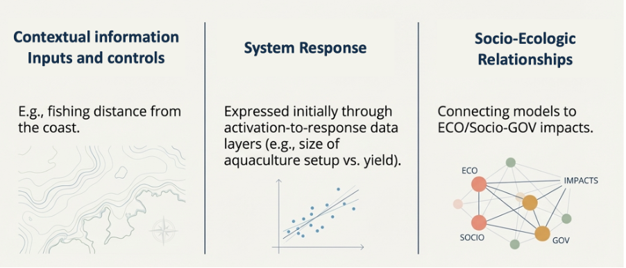

# Provenance-aware marine DT indicator relationships models: SeaDOTs AI harness for derived knowledge
                                               
  Piotr Zaborowski¹, Alejandro Villar¹, Rob Atkinson¹
  ¹ OGC Europe| Open Geospatial Consortium Europe, Leuven, Belgium                                                                                                               
  ---                                               
                                                            
  The SEADOTs project develop predictive socio-ecological system Digital Ocean Twins (DOTs) demonstrators. Central to this project is a discussion about indicators: what they are, who defines them, how to capture and reuse relationships between them. Digital Twins simulating socio-ecological systems process and produce variety of data sources like projections of fisheries yield, renewable energy capacity, species abundance. These assets are the baseline for further insights between simulated system relationships presented on the policies levels — this level is evaluated in the impact assessment and communicated to stakeholders. The outputs of these simulations acquire meaning only through the indicator dependency structures embedded in the underlying models: the fact that increasing wind-park area suppresses fisheries production, or that employment in the tourism sector reinforces bird-watching activity, is what makes a scenario interpretable.
Despite their importance, acquisition pipelines and dependency structures are rarely represented in a FAIR [1], interoperable and verifiable way while DT are strongly contextual and meaningful only in relation to the simulation boundaries. Downstream consumers - other DTs, policy dashboards, model comparison services — cannot discover, validate, or query these relationships without bespoke integration work. Now, with the AI community has finally chance preserve all the provenance and derived knowledge with minimal effort. However, these processes need governance and quality assurance points.

## SeaDOTs
The SeaDOTs project operates three coastal Digital Twin demonstrators in Germany, Norway, and Sweden. Each demonstrator applies a Social-Ecological System (SES) model [2] in which indicators correspond to observable properties of the managed system, control parameters, and model runs that estimates of the directional influence between those properties. Interoperability framework of SeaDOTs is publishing these indicator relationships in a machine-readable, provenance-rich form connected to the experiment’s boundaries. Though the multi-flavour representation the bundle preserves interoperability with the EDITO marine platform and the European Open Science Cloud (EOSC). 

## Indicators Model 
Proposed Indicators relationship model is 3 level architecture. SES model level represents Actors, Governance, Resource System with Resource Units and their interactions. Variables level represents relationships discovered with Digital Twins or collected during desk research based on the scientific studies or derived from the simulations. Digital Twins execution level represents relationships between marine models; Agents Based Systems, numerical modelling, fuzzy-cognitive maps. 
 
  Figure 1 3-tier Digital Twin Indicators Model
The model is traversed in both directions in the SeaDOTs scenarios. Based on the fuzzy-cognitive system description to weight importance of the variables in the model. On the other hand, attribution is derived with AI processing system response to various activations.

## Practical implementation
Project captures all the processing assets and analyses them using AI assisted data mining techniques to augment metadata based on the harness of OGC Building Blocks (OBB) tailored for the DTO-SES, and Definition Server made available for all in EDITO.
DT execution model in OBBs define standards extensions with crosswalks to semantic models through context definitions and transformers. This way it is fully reusable and machine interpretable pattern. Property Relationship, which is other OBB template can include relation to variables (SOSA/SSN based) [3], equations, symbol-variable mappings, PROV-O [4] provenance & attribution, QUDT-quantified weights, and SHACL validation, on top of generic ISO/STAC/DCAT/OGC properties collected in the Ocean Information Model (OIM) [5]. Based on the ontology, it has JSON/JSON-LD schema for wider community adoption. Applied to the Norwegian Utsira wind-farm demonstrator, the model enables machine-readable cross-impact matrices to be queried and used in the impact calculations. Building Block approach makes it possible to bind variables to vocabularies and this way to the data assets. The building block is registered in the OGC Building Block Register and is designed for reuse across the ILIAD Ocean Digital Twin ecosystem.
The model is embedded in the STAC/OGC Records extension for machine readable ODD protocol [6]. The model together with the open-source agents allow to extend the to the policies actors relations to match SES model.
SEADOTs project is funded by the EU Horizon Europe Research and Innovation Programme under Grant Agreement No. 101156488 

## References
  [1] Wilkinson et al. (2016). The FAIR Guiding Principles for scientific data management. Scientific Data 3, 160018 
  [2] Ostrom, E. (1990). Governing the Commons. Cambridge University Press
  [3] Haller et al. (2019). The Modular SSN Ontology: A Joint W3C and OGC Standard. Semantic Web 10(1), 9–32 
  [4] Moreau & Missier (eds.) (2013). PROV-O: The PROV Ontology. W3C Recommendation
  [5] ILIAD project (2023). Ocean Information Model. https://github.com/ILIAD-ocean-twin/OIM 
[6] Grimm et al. (2020). The ODD Protocol for Describing Agent-Based and Other Simulation Models: A Second Update to Improve Clarity, Replication, and Structural Realism. Journal of Artificial Societies and Social Simulation. 23. 10.18564/jasss.4259.

## ORCID:
Piotr Zaborowski 0000-0003-4990-2008
Rob Atkinson 0000-0002-7878-2693
Alejandro Villar 0000-0002-5655-2686
 

